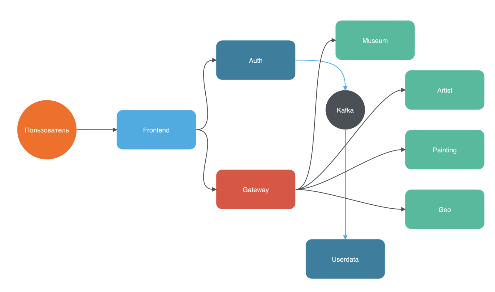

# Rococo

Приветствую тебя, мой дорогой студент!
Если ты это читаешь - то ты собираешься сделать первый шаг в написании диплома QA.GURU Advanced.

Это один из двух вариантов дипломной работы - второй
расположен [тут, называется Rangiffler](https://github.com/qa-guru/rfr)
Проекты отличаются как по своей механике, так и технологиям (Rococo использует классический REST на frontend,
тогда как Rangiffler использует GraphQL). Следует сказать, что Rangiffler может отказаться немного сложнее именно из-за
GraphQL.
Выбор за тобой!

Далее я опишу основные направления работы, но помни, что этот диплом - не шаблонная работа, а место
для творчества - прояви себя!

Кстати, Rococo - стиль в искусстве (живописи и не только), а значит дело пахнет микросервисами,
отвечающими за художников, их картины и музеи. И тестами на все это, которые должны стать искусством.

# Что будет являться готовым дипломом?

Тут все просто, диплом глобально требует от тебя реализовать три вещи:

- Реализовать бэкенд на микросервисах (Spring boot, но если вдруг есть желание использовать что-то другое - мы не
  против)
- Реализовать полноценное покрытие тестами микросервисов и frontend (если будут какие-то
  unit и integration-тесты - это большой плюс!)
- Красиво оформить репозиторий на гихабе, что бы любой, кто зайдет на твою страничку, смог понять,
  как все запустить, как прогнать тесты. Удели внимание этому пункту. Если я не смогу все запустить по твоему README -
  диплом останется без проверки

# С чего начать?

Мы подготовили для тебя полностью рабочий frontend, а также минимально работающий сервис auth и базовую реализацию
сервиса rcc-api.
Сервис rcc-api реализован как монолитный REST API backend, где часть данных (художники и картины) замокана через JSON
файлы,
а часть (музеи, страны, пользователи) работает с реальной базой данных MySQL. Это позволяет сразу увидеть механику
проекта Rococo
и понять, какие запросы необходимо реализовать в полноценном микросервисном бэкенде.

И самое главное - у тебя есть проект niffler, который будет выступать образцом для подражания в разработке
микросервисов.
Тестовое покрытие niffler, которого мы добьемся во время курса, однако, не будет полноценным - учтите это при написании
тестов на Rococo - это,
все-таки, диплом для SDET / Senior QA Automation и падать в грязь лицом с десятком тестов на весь сервис
точно не стоит. Итак, приступим!

#### 1. Запусти базу данных MySQL:

```posh
Dmitriis-MacBook-Pro rococo % bash localenv.sh
```

Скрипт запустит Docker контейнер с MySQL, создание необходимых баз данных для rococo-auth и rococo-api произойдет при
старте этих бэкендов.

#### 2. Запусти сервис авторизации rococo-auth:

```posh
Dmitriis-MacBook-Pro rococo % cd rcc-auth
Dmitriis-MacBook-Pro rcc-auth % gradle bootRun
```

Или запусти класс с методом main руками. Auth будет доступен на порту 9000: http://localhost:9000

#### 3. Запусти сервис API rococo-api:

```posh
Dmitriis-MacBook-Pro rococo % cd rcc-api
Dmitriis-MacBook-Pro rcc-api % gradle bootRun
```

Или запусти класс с методом main руками. API будет доступен на порту 8080: http://localhost:8080

Сервис rcc-api содержит:

- Mock контроллеры для художников и картин (данные из JSON файлов в resources/mock/)
- Реальные контроллеры для музеев, стран и пользователей (работают с MySQL)
- OAuth 2.0 Resource Server защиту для POST/PATCH/DELETE операций

#### 4. Обнови зависимости и запускай фронт Rococo:

```posh
Dmitriis-MacBook-Pro rococo % cd rcc-client
Dmitriis-MacBook-Pro rcc-client % npm i
Dmitriis-MacBook-Pro rcc-client % npm run dev
```

Фронт стартанет в твоем браузере на порту 3000: http://localhost:3000/

Теперь можно залогиниться через кнопку "Войти" и работать с приложением. GET запросы доступны без авторизации,
а для создания/редактирования данных потребуется OAuth токен, который выдается после успешной авторизации.

# Что дальше?

#### 1. Изучи существующую реализацию rcc-api

Сервис rcc-api уже содержит базовую реализацию REST API:

- Mock контроллеры для художников и картин (ArtistMockController, PaintingMockController)
- Реальные контроллеры для музеев, стран и пользователей с JPA репозиториями
- Security конфигурацию OAuth 2.0 Resource Server
- Модели данных (Entity и JSON DTO)
- Flyway миграции для базы данных

Это хорошая отправная точка для понимания структуры API и требований фронтенда.

#### 2. Спроектируй микросервисную архитектуру

Например, можно предложить вот такую структуру сервисов:



ВАЖНО! Картинка - не догма, а лишь один из вариантов для примера.
Взаимодействие между gateway и всеми остальными сервисами можно сделать с помощью
REST, gRPC или SOAP. Я бы посоветовал отдать предпочтение gRPC.

Возможные варианты разбиения:

- rococo-gateway - единая точка входа для фронтенда
- rococo-artist - сервис управления художниками
- rococo-painting - сервис управления картинами
- rococo-museum - сервис управления музеями
- rococo-userdata - сервис управления пользовательскими данными

#### 3. Реализуй микросервисы постепенно

Начни с одного микросервиса, например rococo-artist:

- Создай новый Spring Boot модуль
- Перенеси логику из ArtistMockController в полноценный сервис с БД
- Настрой взаимодействие с gateway через выбранный протокол (REST/gRPC)
- Добавь Flyway миграции для таблицы artists

Затем повтори процесс для остальных сервисов.

#### 4. Докеризация сервисов

Чем раньше у вас получится запустить в докере фронт и все бэкенды, тем проще будет дальше.
На самом деле, докеризация не является строго обязательным требованием, но если вы хотите в будущем
задеплоить свой сервис на прод, прикрутить CI/CD, без этого никак не обойдется.

Я советую использовать плагин jib - как в niffler, для бэкендов, и самописный dockerfile для фронта.
Фронтенд использует фреймворк Svelte, но докеризация там работает ровно так же, как и для React в Niffler.

#### 5. Выбери протокол взаимодействия между сервисами

В поставляемом фронтенде классический REST. А вот взаимодействие между микросервисами можно
делать как угодно! REST, gRPC, SOAP. Делай проект я, однозначно взял бы gRPC - не писать руками кучу
model-классов, получить перформанс и простое написание тестов. Стоит сказать, что здесь не
понадобятся streaming rpc, и все ограничится простыми унарными запросами. Однако если вы хотите
использовать REST или SOAP - мы не будем возражать.

#### 6. Реализуй полноценный микросервисный backend

Это место где, внезапно, СОВА НАРИСОВАНА!
На самом деле, концептуально и технически каждый сервис будет похож на что-то из niffler, поэтому
главное внимательность и аккуратность. Любые отхождения от niffler возможны - ты можешь захотеть
использовать, например, NoSQL базы или по другому организовать конфигурацию / структуру проекта -
никаких ограничений, лишь бы сервис выполнял свое прямое назначение.

Используй существующий rcc-api как референс для понимания API контрактов и бизнес-логики.

##### Особенности реализации backend

###### Работа с пагинацией

Проект Rococo использует пагинацию (чтобы грузить данные с бэка по частям), а это значит что в контроллерах должны быть
реализованы
Pageable endpoints. В rcc-api уже есть примеры такой реализации.

Пример контроллера:

```java
  @GetMapping()
  public Page<ArtistJson> getAll(@RequestParam(required = false) String name,
                                 @PageableDefault Pageable pageable) {
    return artistService.getAll(name, pageable);
  }
```

Здесь объект `Pageable` приходит в виде GET параметров с фронта. Spring сам превратит GET параметры в этот объект.
Также GET параметром может прийти (а может и нет) параметр name. Тогда запрос в БД должен включать фильтрацию по полю
name (`ContainsIgnoreCase`)

Пример репозитория с запросом к БД с учетом Pageable и name:

```java
public interface ArtistRepository extends JpaRepository<ArtistEntity, UUID> {

  @Nonnull
  Page<ArtistEntity> findAllByNameContainsIgnoreCase(
          String name,
          Pageable pageable
  );
}
```

Тип `Page<T>` - это ровно то, что ожидает получить фронт. Преобразовать Entity в JSON DTO можно через метод `map()`:

```java
return artistRepository.findAllByNameContainsIgnoreCase(name, pageable)
    .map(ArtistJson::fromEntity);
```

Почитать про пагинацию дополнительно: https://www.baeldung.com/spring-data-jpa-pagination-sorting

###### Передача `Pageable` по gRPC между сервисами, возврат `Page` из сервисов

Если ты выберешь gRPC для взаимодействия между микросервисами, то передача пагинации будет выглядеть так:

Когда с фронта приходит `@PageableDefault Pageable pageable` - из него можно достать две цифры -
`page` и `size`, плюс опциональный параметр фильтрации (например, `name`). Тогда gRPC сообщение в сервис с художниками
могло бы выглядеть так:

```protobuf
message ArtistsRequest {
  string name = 1;
  int32 page = 2;
  int32 size = 3;
}

message ArtistsResponse {
  repeated Artist artists = 1;
  int32 total_count = 2;
}
```

Тогда в gateway можно вернуть на фронт созданный вручную Page:

```java
            List<ArtistJson> artistJsonList = response.getArtistsList()
                    .stream()
                    .map(ArtistJson::fromGrpcMessage)
                    .toList();
            return new PageImpl<>(artistJsonList, pageable, response.getTotalCount());
```

Здесь объект `pageable` - это тот, что мы изначально получили от фронта для выполнения запроса, а
`response.getTotalCount()`

- общее число художников в базе.

###### Security config

Необходим доступ без авторизации к эндпойнту `/api/session` и к GET запросам.
Пример реализации из rcc-api (RococoApiConfiguration):

```java
  @Bean
  public SecurityFilterChain securityFilterChain(HttpSecurity http) throws Exception {
    corsCustomizer.apply(http);
    http.csrf(AbstractHttpConfigurer::disable)
        .authorizeHttpRequests(customizer ->
            customizer
                .requestMatchers(GET, "/api/session").permitAll()
                .requestMatchers(GET, "/api/artist/**").permitAll()
                .requestMatchers(GET, "/api/museum/**").permitAll()
                .requestMatchers(GET, "/api/painting/**").permitAll()
                .anyRequest().authenticated()
        )
        .oauth2ResourceServer(oauth2 -> oauth2.jwt(Customizer.withDefaults()));
    return http.build();
  }
```

Все прочие эндпойнты (POST, PATCH, DELETE) требуют авторизацию через JWT токен.

В связи с тем, что проект подразумевает GET запросы без авторизации, тесты должны учитывать разные кейсы -
авторизованный пользователь и нет.

#### 7. Подготовь структуру тестового фреймворка

Здесь однозначно понадобится возможность API-логина и работы со всеми возможными preconditions проекта - картинами,
художниками, музеями. Например, было бы хорошо иметь тесты примерно такого вида:

```java
@Test
@DisplayName("...")
@Tag("...")
@ApiLogin(user = @TestUser)
@TestMuseum(title = "Музей в Китай", country = "Китай", city = "Пекин")
void exampleTest(MuseumJson createdMuseum) { ... }

@Test
@DisplayName("...")
@TestPainting
@TestMuseum
@TestArtist
@Tag("...")
void exampleTest2(PaintingJson createdPainting, MuseumJson createdMuseum, ArtistJson createdArtist) { ... }
```

Используй существующий rcc-api для понимания API контрактов.

#### 8. Реализуй достаточное покрытие e2e тестами

На наш взгляд, только основных позитивных сценариев тут не менее трех десятков.
А если не забыть про API-тесты (будь то REST или gRPC), то наберется еще столько же.

#### 9. Реализуй запуск тестов в CI pipeline GHA

И загрузку Allure в учебный Allure Server или GithubPages

#### 10. Оформи все красиво!

Да, тут еще раз намекну про важность README, важность нарисовать топологию (схему) твоих сервисов, важность скриншотов и
прочих красот.
Очень важно думать о том, что если чего-то не будет описано в README, то и проверить я это что-то не смогу.


